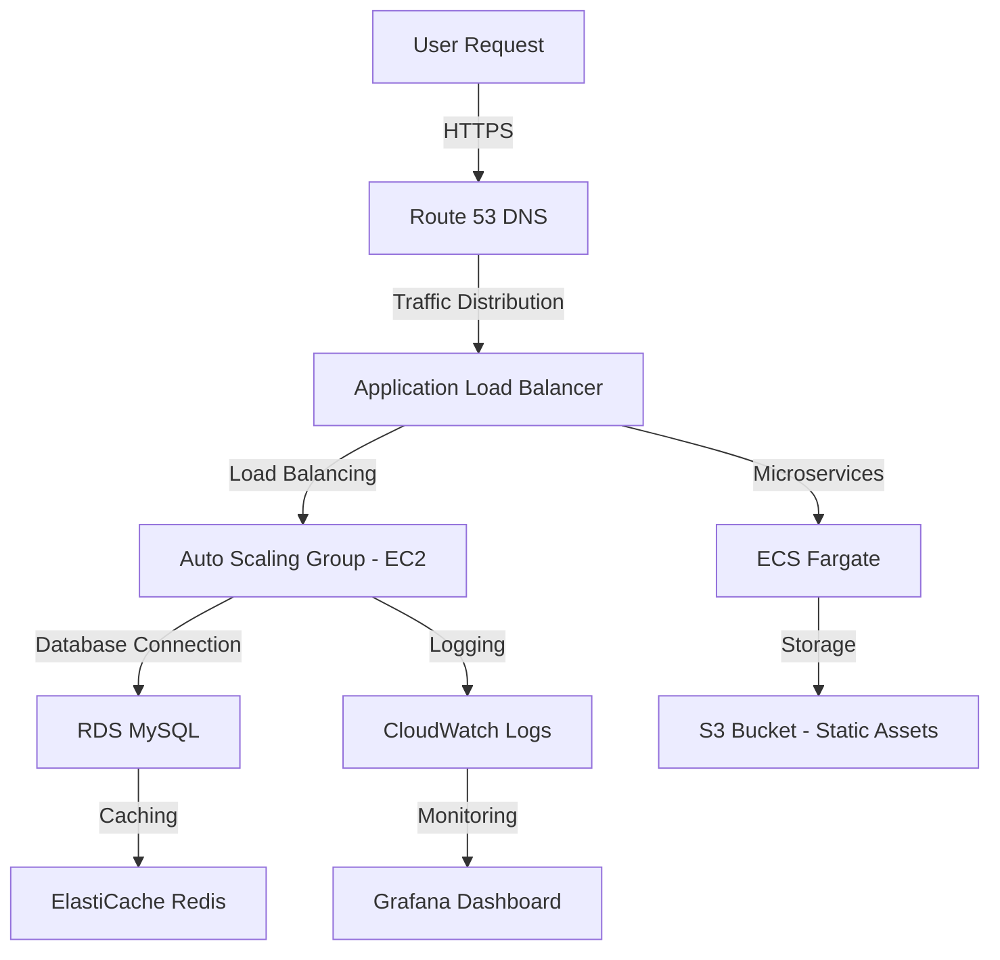

# 🚀 Next-Gen AWS E-Commerce Infrastructure with Terraform

**Scalable, Secure, and Cost-Efficient AWS Infrastructure for E-Commerce Applications**

[](https://www.notion.so/Next-Gen-AWS-E-Commerce-Infrastructure-with-Terraform-CI-CD-Scalable-Secure-Cost-Efficient-189d1728bdbc803fa47be55f0b5cf110)

[](https://www.terraform.io/)
[](https://aws.amazon.com/)
[](https://www.linkedin.com/in/ayman-mohamed1043/)


---

## 🌟 Solution Overview
A **highly scalable and secure AWS infrastructure** designed for e-commerce applications, leveraging **Terraform for Infrastructure as Code (IaC)**. The solution ensures **high availability, fault tolerance, and cost optimization** while integrating CI/CD for seamless deployment.

### 🏆 Key Features
| Feature | Benefit |
|---------|---------|
| ⚡ **Auto-Scaling** | Automatically scales based on traffic demands |
| 🔐 **Security Best Practices** | IAM, Security Groups, and WAF for robust protection |
| 💰 **Cost Optimization** | Uses Spot Instances and Savings Plans effectively |
| 🔄 **CI/CD Pipeline** | Automated deployment with GitHub Actions & CodePipeline |
| 🌎 **Global Reach** | Multi-Region setup for maximum availability |


---

## 🛠️ Technical Components
| Layer | AWS Services |
|--------|----------------------|
| **Compute** | EC2, ECS (Fargate) |
| **Networking** | VPC, ALB, Route 53 |
| **Storage** | S3, EBS, RDS (MySQL) |
| **Security** | IAM, Security Groups, WAF |
| **Monitoring** | CloudWatch, Grafana |
| **CI/CD** | CodePipeline, GitHub Actions |

---

## 📂 Project Structure
```
├── terraform/
│   ├── modules/
│   │   ├── vpc.tf
│   │   ├── ec2.tf
│   │   ├── ecs.tf
│   │   ├── rds.tf
│   │   ├── s3.tf
│   │   ├── security.tf
│   │   ├── alb.tf
│   │   ├── cloudwatch.tf
│   ├── main.tf
│   ├── variables.tf
│   ├── outputs.tf
│   ├── backend.tf
│   ├── providers.tf
│── .github/
│   ├── workflows/
│   │   ├── terraform-ci.yml
│   │   ├── terraform-deploy.yml
│── README.md
│── .gitignore
```

---

## 🚀 Deployment Guide

### 🏗️ Prerequisites
1. Install [Terraform](https://www.terraform.io/downloads.html)
2. AWS CLI configured with IAM permissions
3. GitHub repository with CI/CD workflows

### ⏳ Steps to Deploy
```sh
# Clone the repository
$ git clone https://github.com/your-repo.git
$ cd terraform

# Initialize Terraform
$ terraform init

# Plan the deployment
$ terraform plan

# Apply changes
$ terraform apply -auto-approve
```

---
---

## 🏗️ AWS Architecture Stack


## 🤝 Connect with Me
- **LinkedIn**: [Ayman Mohamed](https://www.linkedin.com/in/ayman-mohamed1043/)
- **Notion**: [Project Documentation](https://www.notion.so/Next-Gen-AWS-E-Commerce-Infrastructure-with-Terraform-CI-CD-Scalable-Secure-Cost-Efficient-189d1728bdbc803fa47be55f0b5cf110)
- **Terraform**: [Official Website](https://www.terraform.io/)
- **AWS**: [Amazon Web Services](https://aws.amazon.com/)

---
Thanks.
